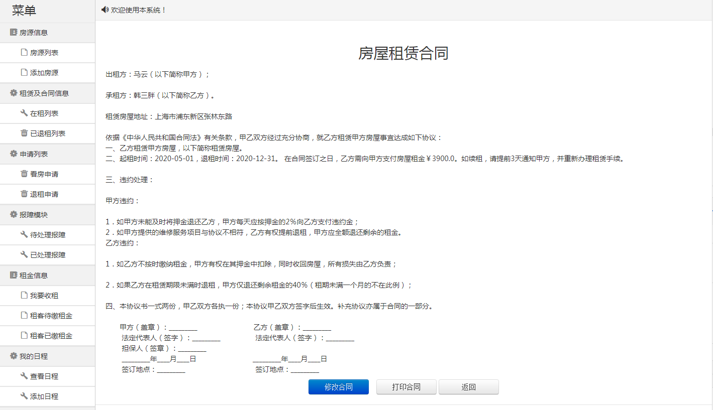
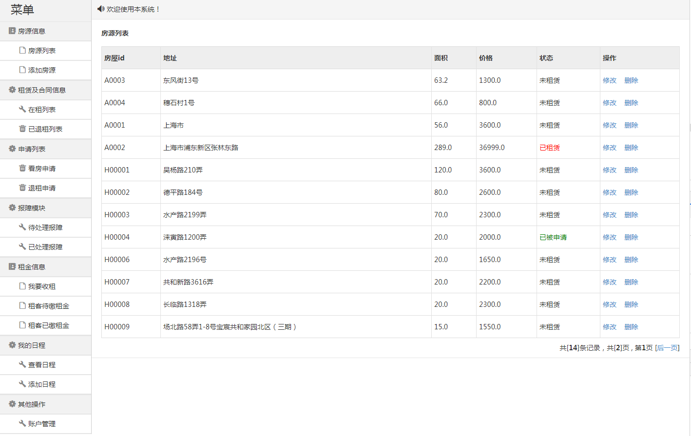
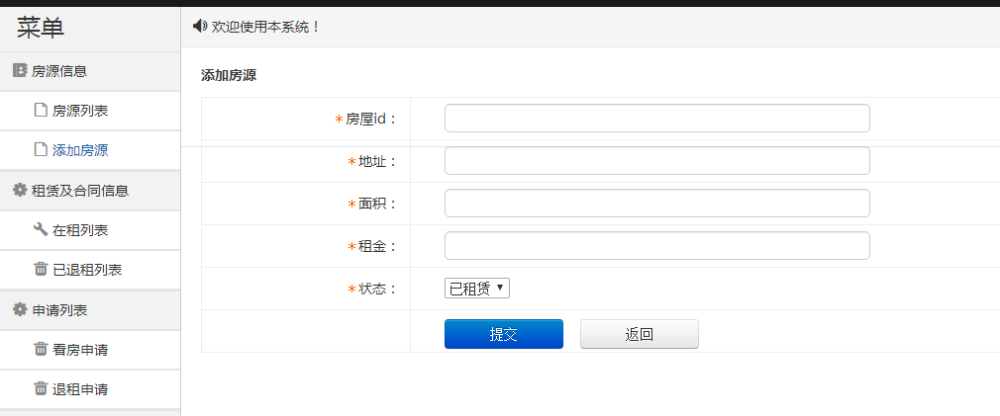
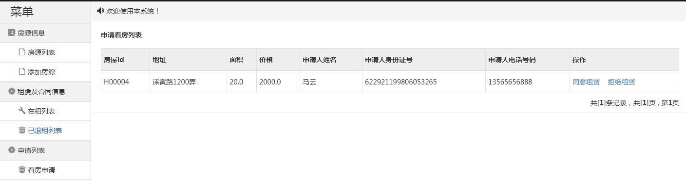
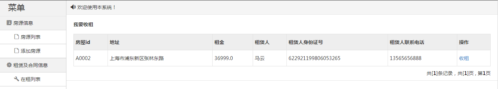

基于SSM的房屋租赁系统
=
### 完整代码获取地址：从戎源码网 ([https://armycodes.com/](https://armycodes.com/))
### 作者微信：19941326836  QQ：952045282 
### 承接计算机毕业设计、Java毕业设计、Python毕业设计、深度学习、机器学习
### 选题+开题报告+任务书+程序定制+安装调试+论文+答辩ppt 一条龙服务
### 所有选题地址https://github.com/nature924/allProject

一、项目介绍
---
基于SSM框架的房屋租赁系统，系统分为租客和管理员两个角色，主要功能如下

### 
租客：
房源信息：房源列表
租赁信息：在租列表、已退租列表
租金信息：代缴租金、已缴租金
报障模块：我要报障、未处理报障、已处理报障
###
管理员：
房源信息：房源列表、添加房源
租赁及合同信息：在租列表、已退租列表
申请列表：看房申请、退租申请
报障模块：待处理报障、已处理报障
租金信息：我要收租、租客代缴租金、租客已缴租金
我的日程：查看日程、添加日程

二、项目技术
---
- 编程语言：Java
- 数据库：MySQL
- 项目管理工具：Maven
- 前端技术：JSP、HTML、Jquery、Layui、ECharts
- 后端技术：Spring、SpringMVC、MyBatis

三、运行环境
---
- 操作系统：Windows、macOS都可以
- JDK版本：JDK1.8以上都可以
- 开发工具：IDEA、Ecplise、Myecplise都可以
- 数据库: MySQL5.7以上都可以
- Tomcat：任意版本都可以
- Maven：任意版本都可以

四、运行截图
---

### 程序截图：

